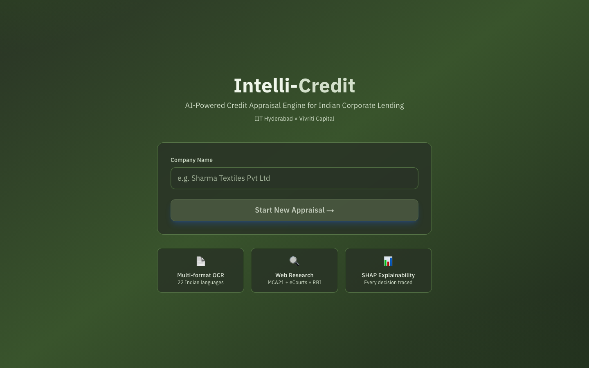
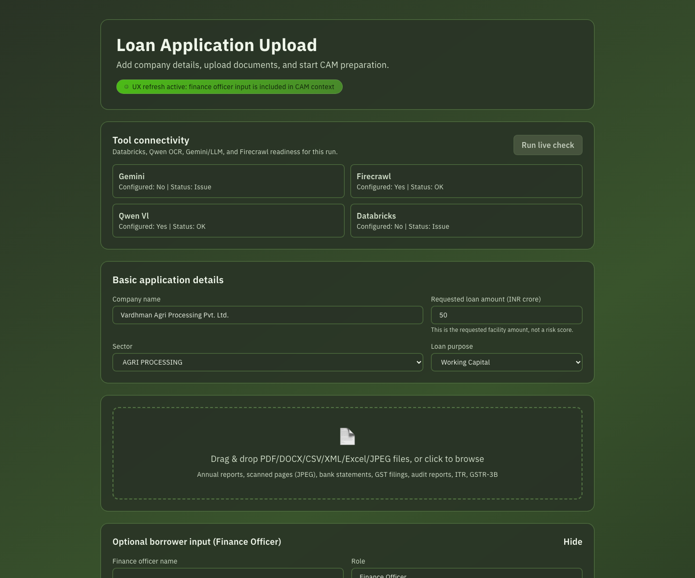
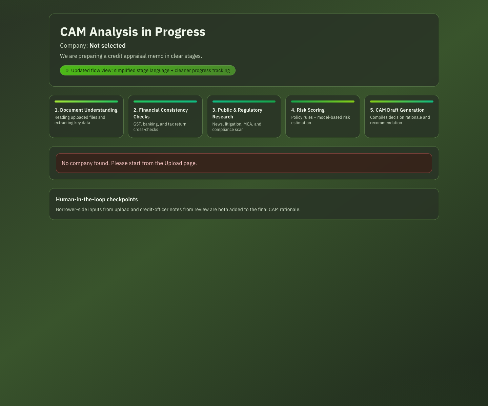
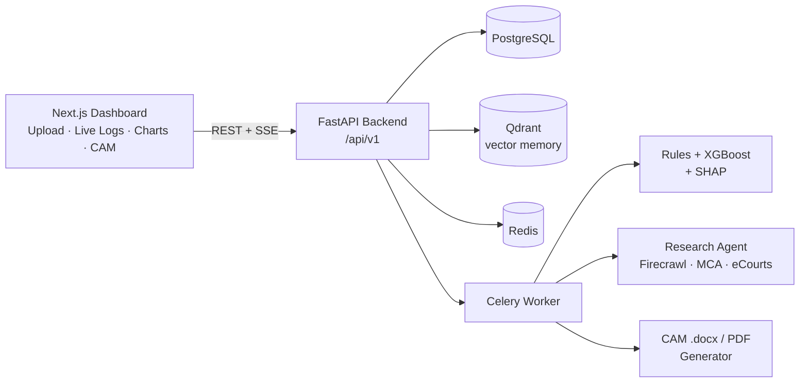

<div align="center">

# Intelli-Credit

### AI-Powered Corporate Credit Appraisal Engine for Indian Lending

*Turns a pile of raw borrower documents into an explainable credit decision and a bank-ready Credit Appraisal Memo (CAM) — with live web due-diligence and human-in-the-loop review.*


</div>

<p align="center">
  
</p>

---

## What it does

A credit officer at an NBFC or bank receives a corporate loan application as a mess of PDFs, scanned pages, GST returns, bank statements, and ITRs. Turning that into a defensible sanction decision takes days of manual work. **Intelli-Credit compresses that into an automated, auditable pipeline:**

1. **Ingest** multi-format documents (PDF / DOCX / CSV / XML / XLSX / JPEG / PNG) and OCR scanned pages with a vision-language model.
2. **Cross-validate** GST vs. banking vs. ITR data to surface ITC mismatches, circular-trading patterns, and window-dressing.
3. **Research** the borrower live on the web — MCA filings, eCourts litigation, adverse news, promoter background.
4. **Score** risk with a rules engine + XGBoost model, and explain every point of the score with SHAP.
5. **Generate** a 9-section Credit Appraisal Memo (`.docx` / PDF) with a plain-language rationale.
6. Keep a **credit officer in the loop** — their due-diligence notes feed directly into the final score and memo.

---

## Screenshots

| Document upload + live tool connectivity | Staged analysis pipeline |
|---|---|
|  |  |

> The **Tool Connectivity** panel runs a live readiness check against Firecrawl (web research), the Qwen2.5-VL OCR model, and the LLM provider before each run.

A sample generated Credit Appraisal Memo is included at [`docs/sample_output/Sample_CAM_Vardhman_Agri.docx`](docs/sample_output/Sample_CAM_Vardhman_Agri.docx).

---

## Architecture



**Pipeline:** Multi-source input → Document processing (OCR + LLM parsing) → Structured knowledge store (SQL + vector + Delta) → Web research agent → Explainable risk scoring → CAM generation → Credit-officer portal.

Full detail in [ARCHITECTURE.md](./ARCHITECTURE.md).

---

## Tech stack

| Layer | Technology |
|---|---|
| **Frontend** | Next.js 14, React 18, TailwindCSS, Recharts, D3, Zustand |
| **Backend** | FastAPI, Pydantic, async SQLAlchemy, structured logging |
| **ML / scoring** | XGBoost, scikit-learn, SHAP, hard-rejection rules engine |
| **Document AI** | PyMuPDF + pdfplumber, Qwen2.5-VL OCR, Tesseract fallback |
| **Research agent** | Firecrawl live crawling, LLM finding-extraction & scoring |
| **LLMs** | Cerebras / Hugging Face / Gemini with automatic provider fallback |
| **Data** | PostgreSQL, Qdrant (vectors), Delta Lake (local Spark / Databricks) |
| **Orchestration** | Celery + Redis, Prefect flow wrapper |
| **Infra** | Docker Compose (6-service stack) |

---

## Quick start

The whole stack runs with one command — it works out of the box in **mock mode** (deterministic, no API keys required), which is ideal for a first run.

```bash
git clone https://github.com/harshithh-18/Intelli-Credit.git
cd Intelli-Credit
cp .env.example .env
docker compose up --build
```

| Service | URL |
|---|---|
| Frontend dashboard | http://localhost:3000 |
| API docs (Swagger) | http://localhost:8001/docs |

Then open the dashboard, enter a company name, upload the sample documents in [`data/sample_documents/`](data/sample_documents/), and run an appraisal.

### Enabling live mode (real AI)

Mock mode needs no keys. For **live** OCR, web research, and LLM narratives, add these to `.env` (all have free tiers):

| Variable | Provider | Notes |
|---|---|---|
| `CEREBRAS_API_KEY` | [Cerebras](https://cloud.cerebras.ai/) | Fast free LLM (`csk-...`). Primary provider. |
| `QWEN_VL_API_KEY` | [Hugging Face](https://huggingface.co/settings/tokens) | Qwen2.5-VL OCR (`hf_...`). |
| `FIRECRAWL_API_KEY` | [Firecrawl](https://www.firecrawl.dev/) | Live web crawling (`fc-...`). |

Then set `RESEARCH_MODE=live` and restart. See [`.env.example`](.env.example) for the full list.

> **Note:** do not wrap `.env` values in quotes — the values are passed through verbatim. Keep live-research volume modest (`MAX_RESEARCH_SOURCES_PER_COMPANY`) to stay within free-tier LLM rate limits.

---

## API surface (`/api/v1`)

```
POST /companies                      Create a borrower
POST /companies/{id}/documents       Upload documents (multi-format)
POST /companies/{id}/analyze         Run the appraisal pipeline
GET  /companies/{id}/status          Live progress (SSE)
POST /companies/{id}/dd-input        Credit-officer due-diligence input
GET  /companies/{id}/results         Full result payload
GET  /companies/{id}/explain         SHAP explainability
GET  /companies/{id}/research        Research findings
GET  /companies/{id}/report[/pdf]    Download the CAM
POST /companies/{id}/chat            Chat over the CAM
```

Every `/api/v1` response uses a standard envelope with a request ID, timestamp, and processing time.

---

## Testing

```bash
pip install -r requirements.txt
pytest -q tests/backend
```

---

## Highlights for reviewers

- **Explainability-first:** every credit decision ships with SHAP factor attribution and a plain-language narrative — no black-box scores.
- **India-context modeling:** GST ITC-fraud thresholds, sector multipliers, MCA/eCourts checks, and RBI-aligned terminology.
- **Resilient by design:** provider fallback chains for LLMs, OCR fallback to Tesseract, and a deterministic mock mode so demos never break.
- **Human-in-the-loop:** credit-officer notes are fused into both the score and the final memo.

---

<div align="center">

**Built by [Harshith Gottipati](https://github.com/harshithh-18)** · 

</div>
